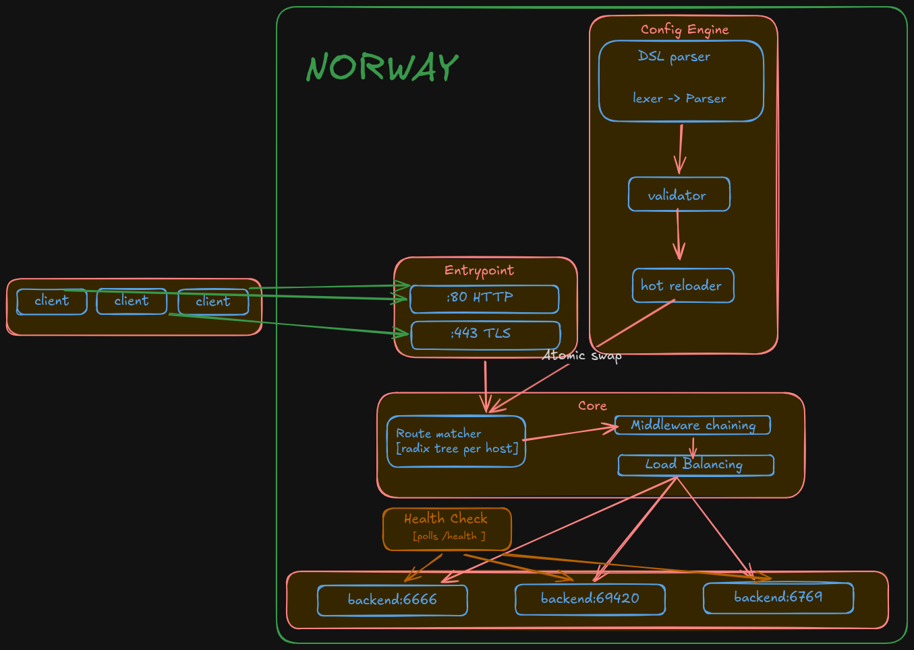
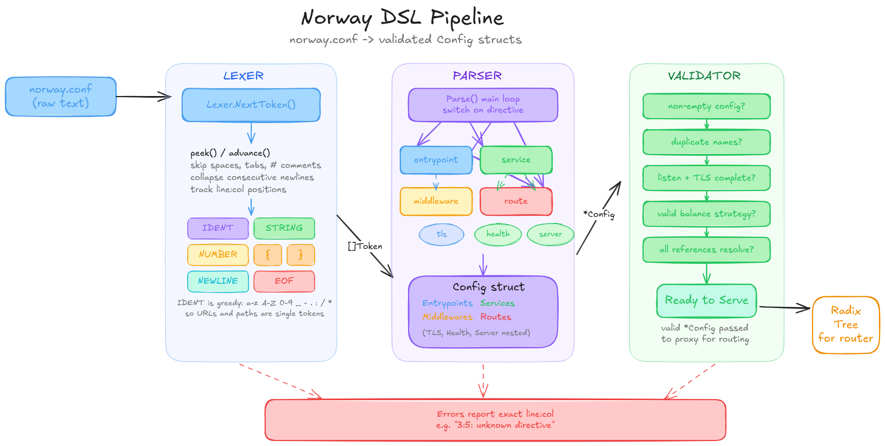
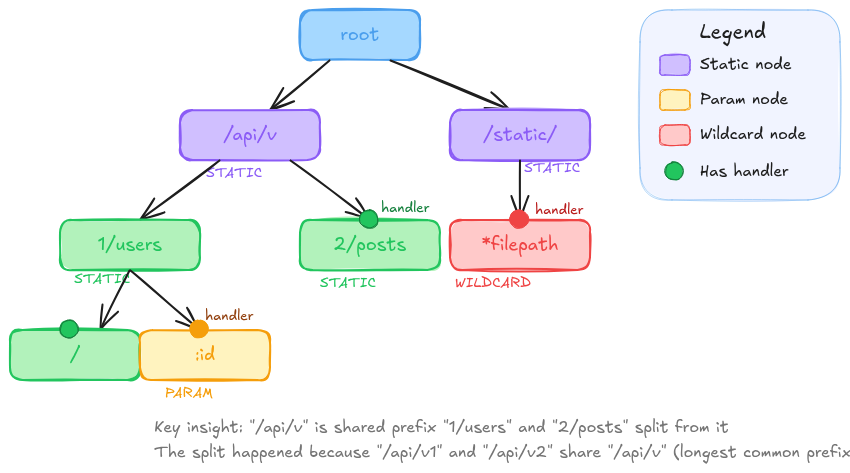
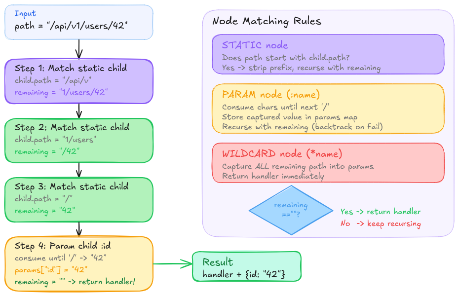
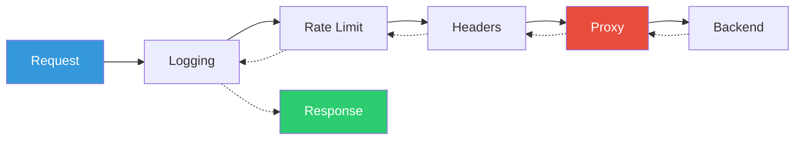

# norway

A focused, observable reverse proxy with a clean config DSL. An alternative to Traefik for people who don't need Kubernetes, service discovery, or a 100MB binary.

Norway is a single binary that reads a `.conf` file and proxies HTTP traffic to your backends with route matching, middleware chains, load balancing, health checks, rate limiting, live stats, hot reload, and TLS termination. No YAML indentation hell, no 47-page documentation to read before you can route a request.

```
20,000 req/s sustained, 100% success, p99 = 14.6 ms
 5,000 req/s sustained, 100% success, p99 = 908 us
 ~95 us proxy overhead vs direct backend
 ~63 ns radix tree lookup, zero allocations
 ~21 us full hot reload cycle (lex + parse + validate + build + swap)
```

Numbers from a Ryzen 7 5800HS. Full breakdown in [bench/README.md](bench/README.md). Run `make bench-all` to reproduce.

## Getting Started

### 1. Build

```bash
git clone https://github.com/pixperk/norway
cd norway
go build -o norway ./cmd/norway
```

### 2. Write a config

Save this as `norway.conf`:

```nginx
entrypoint web {
    listen :8080
}

service api {
    server http://localhost:9000
}

middleware logger {
    type logging
    format json
}

route api {
    entrypoints web
    host localhost
    service api
    use logger
}
```

### 3. Start a backend

In one terminal, run any HTTP server on port 9000. Norway ships with a tiny test backend you can use:

```bash
go run ./cmd/testbackend :9000
```

### 4. Run norway

```bash
./norway -config norway.conf
```

Norway will print `norway listening on :8080` and start proxying.

### 5. Hit it

```bash
curl http://localhost:8080/hello
```

You should see the backend response, plus a structured JSON log line in the norway terminal.

### 6. Check live stats

```bash
curl http://localhost:8080/norway/stats
```

### 7. Hot reload

Edit `norway.conf` while norway is running and save. The file watcher reloads automatically. You can also `kill -HUP $(pgrep norway)` or `curl -X POST http://localhost:8080/norway/reload`.

For the full DSL reference (every directive, every middleware type, validation rules), see [SYNTAX.md](SYNTAX.md).

## Architecture



## The Config DSL

Norway uses its own config language. No YAML, no TOML, no JSON. Just a clean block-based DSL that's purpose-built for proxy configuration.

The DSL goes through a full compilation pipeline: `text -> tokens -> AST -> config structs -> validation`. Errors report exact line and column numbers.

Full reference: [SYNTAX.md](SYNTAX.md).

```nginx
# entrypoints define where norway listens
entrypoint web {
    listen :80
}

entrypoint websecure {
    listen :443
    tls {
        cert /etc/norway/cert.pem
        key  /etc/norway/key.pem
    }
}

# services define backend pools
service api {
    balance round-robin

    health {
        path     /health
        interval 10s
        timeout  2s
    }

    server http://localhost:8001 {
        weight 3
    }
    server http://localhost:8002
}

# middlewares are reusable across routes
middleware rate-limit {
    type ratelimit
    rate 100
    burst 50
}

middleware logger {
    type logging
    format json
}

# routes are the glue: match requests and send them to services
route api {
    entrypoints web websecure
    host api.example.com
    path /v1/*
    service api
    use rate-limit
    use logger
}
```

Four block types, three layers of abstraction:
- **Entrypoints** define where to listen
- **Services** define where to forward (backends + load balancing + health checks)
- **Routes** match requests (host + path) and connect entrypoints to services
- **Middlewares** transform requests/responses, reusable across routes

### DSL Pipeline



The lexer tokenizes the raw text into typed tokens (idents, strings, numbers, braces, newlines). The parser consumes tokens and builds an AST of entrypoint/service/middleware/route nodes. The validator checks semantic correctness: do referenced services exist? Are there duplicate names? Is the balance strategy valid?

## Radix Tree Routing

Routes are matched using a radix tree (compressed trie). One tree per host. Lookup is O(k) where k = path length, not O(n) routes.



### Mechanism



Supports:
- **Static segments** `/api/v1/users`, exact match
- **Param segments** `/users/:id`, captures one segment (e.g. `id=42`)
- **Wildcard** `/static/*filepath`, captures everything remaining (e.g. `filepath=css/main.css`)

## Middleware Chain

Every feature that touches a request (logging, headers, rate limiting) is a middleware, a function that wraps an `http.Handler` and returns an `http.Handler`. They compose infinitely via `Chain()`.



Each middleware sees the request on the way in, calls `next.ServeHTTP`, then sees the response on the way out. The logging middleware starts a timer before and logs duration + status after. The headers middleware intercepts `WriteHeader` to inject/remove headers before they're sent to the client.

Configured per-route in the DSL:
```nginx
route api {
    use rate-limit    # first in chain = outermost
    use add-headers
    use logger        # last in chain = closest to proxy
}
```

### Structured Logging

Every request produces a single JSON log line:
```json
{
  "ts": "2026-03-22T10:30:15.123Z",
  "method": "GET",
  "host": "api.example.com",
  "path": "/v1/users",
  "status": 200,
  "duration_ms": 12.34,
  "bytes": 1842,
  "client_ip": "192.168.1.50:48754",
  "user_agent": "curl/8.5.0",
  "proto": "HTTP/1.1"
}
```

## Load Balancing

Each service has a pool of backends and a strategy for picking which one handles the request. All strategies skip unhealthy backends automatically.

| Strategy | Config | How it works |
|----------|--------|-------------|
| **Round-Robin** | `balance round-robin` | Atomic counter, each request goes to the next backend in rotation |
| **Weighted** | `balance weighted` | Backends with higher weight get proportionally more traffic. Weight 3 gets 3x the requests of weight 1 |
| **Least-Conn** | `balance least-conn` | Picks the backend with the fewest active connections. Tracks connections atomically per request |

Configured per service in the DSL:
```nginx
service api {
    balance round-robin

    server http://localhost:8001 {
        weight 3
    }
    server http://localhost:8002
}
```

## Rate Limiting

Per-client IP rate limiting using the token bucket algorithm. Each IP gets its own bucket with a configurable fill rate and burst capacity. When the bucket is empty, requests get a `429 Too Many Requests` with a `Retry-After` header telling the client when to try again.

Stale buckets (idle for 10+ minutes) are cleaned up automatically so memory stays bounded under traffic from many unique IPs.

```nginx
middleware rate-limit {
    type ratelimit
    rate 100       # 100 tokens per second (sustained rate)
    burst 50       # bucket holds 50 tokens (max burst)
}

route api {
    use rate-limit
}
```

- `rate` controls the sustained request rate (tokens refilled per second)
- `burst` controls how many requests can fire at once before throttling kicks in

## Stats Endpoint

Hit `/norway/stats` on any entrypoint to get a live JSON snapshot of the proxy:

```json
{
  "uptime": "2h15m30s",
  "total_requests": 148293,
  "active_conns": 12,
  "routes": {
    "api": { "requests": 120000, "avg_latency_ms": 8.42 },
    "app": { "requests": 28293, "avg_latency_ms": 3.17 }
  },
  "backends": [
    { "url": "http://localhost:8001", "healthy": true, "active_conns": 7 },
    { "url": "http://localhost:8002", "healthy": true, "active_conns": 5 },
    { "url": "http://localhost:3000", "healthy": false, "active_conns": 0 }
  ]
}
```

All counters are atomic. The stats handler reads live pointers to backend state, so health and connection counts are always current, not cached.

## Hot Reload

Editing `norway.conf` does not require a restart. The router lives behind an `atomic.Value` wrapper, and a reload re-runs the full DSL pipeline (lex, parse, validate, build), then atomically swaps the live handler. New requests hit the new config, in-flight requests finish on the old one. Bad configs are logged and the old config keeps running.

Three ways to trigger a reload:

```bash
# 1. Edit the file and save (fsnotify auto-detects)
vim norway.conf

# 2. POST to the reload endpoint
curl -X POST http://localhost:8080/norway/reload

# 3. Send SIGHUP to the process
kill -HUP $(pgrep norway)
```

The file watcher monitors the config directory rather than the file directly so editor write-rename saves (vim, helix) are caught. Old health checkers are stopped on swap so background goroutines do not leak.

## TLS Termination

Norway terminates TLS at the proxy. Clients hit `https://...`, norway does the handshake, decrypts, routes the plain request to the backend over HTTP. Backends never see the cert and never need their own TLS config.

Each entrypoint independently chooses TLS or plain HTTP. The TLS block in the DSL points at a cert and key on disk:

```nginx
entrypoint web {
    listen :8080
}

entrypoint websecure {
    listen :8443
    tls {
        cert certs/cert.pem
        key  certs/key.pem
    }
}
```

For local testing, generate a self-signed cert:

```bash
mkdir -p certs
openssl req -x509 -newkey rsa:2048 -nodes -days 365 \
  -keyout certs/key.pem -out certs/cert.pem \
  -subj "/CN=localhost"
```

Then `curl -k https://localhost:8443/...` works (the `-k` skips cert validation since it is self-signed). TLSv1.3 with ALPN h2 is negotiated by default.

To force all plain traffic to HTTPS, attach the redirect middleware to a route on the plain entrypoint:

```nginx
middleware force-https {
    type https-redirect
    host example.com:8443
}
```

## Benchmarks

Headline numbers, Ryzen 7 5800HS. Full breakdown in [bench/README.md](bench/README.md).

### Hot path (per-request, microbenchmarked)

| Operation                      | Result                |
|--------------------------------|-----------------------|
| Radix tree static lookup       | 63 ns, 0 allocs       |
| Radix tree param lookup        | 43 ns, 0 allocs       |
| Round-robin pick               | 2.5 ns, 0 allocs      |
| Least-conn pick (8 backends)   | 7.5 ns, 0 allocs      |
| Five-middleware chain          | 26 ns, 0 allocs       |
| Logging middleware (JSON)      | 331 ns, 3 allocs      |
| Stats RecordRequest            | 197 ns, 3 allocs      |
| HTTPS redirect (301)           | 576 ns, 4 allocs      |

### End-to-end

| Path                              | Result                |
|-----------------------------------|-----------------------|
| Direct request (no proxy)         | 166 us                |
| Through Norway                    | 261 us (~95 us added) |
| Full hot reload cycle             | 21 us                 |

### Sustained load (vegeta)

| Test                      | Throughput    | p50    | p90     | p99     | Success |
|---------------------------|---------------|--------|---------|---------|---------|
| 5k req/s for 10s          | 5,000 req/s   | 243 us | 634 us  | 908 us  | 100 %   |
| 20k req/s for 10s         | 20,000 req/s  | 380 us | 2.12 ms | 14.6 ms | 100 %   |

Run them yourself:

```bash
make bench         # all microbenchmarks (router, balance, middleware, stats, reload, proxy)
make bench-load    # 5k req/s sustained for 10s
make bench-stress  # 20k req/s for 10s
make bench-all     # everything
make help          # full target list
```

## Progress

### Implemented
- [x] Custom DSL with lexer, parser, and AST
- [x] Config validation with semantic checks
- [x] Radix tree routing with param/wildcard support
- [x] Host-based request dispatching
- [x] End-to-end proxying via `norway.conf`
- [x] Middleware chain (composable, per-route from config)
- [x] Structured JSON request logging (method, host, path, status, duration, bytes, client IP)
- [x] Response header injection and removal
- [x] Load balancing (round-robin, weighted, least-conn)
- [x] Active health checks (background goroutines, auto-remove/restore)
- [x] Token bucket rate limiting (per-client IP, configurable rate/burst)
- [x] Live stats endpoint (`/norway/stats` with routes, backends, latency)
- [x] Hot reload (fsnotify file watch, SIGHUP, `POST /norway/reload`)
- [x] TLS termination (per-entrypoint cert/key, HTTP -> HTTPS redirect)
- [x] Benchmarks (microbench + vegeta load test, see [bench/](bench/))

### Coming Up
- [ ] TUI dashboard
