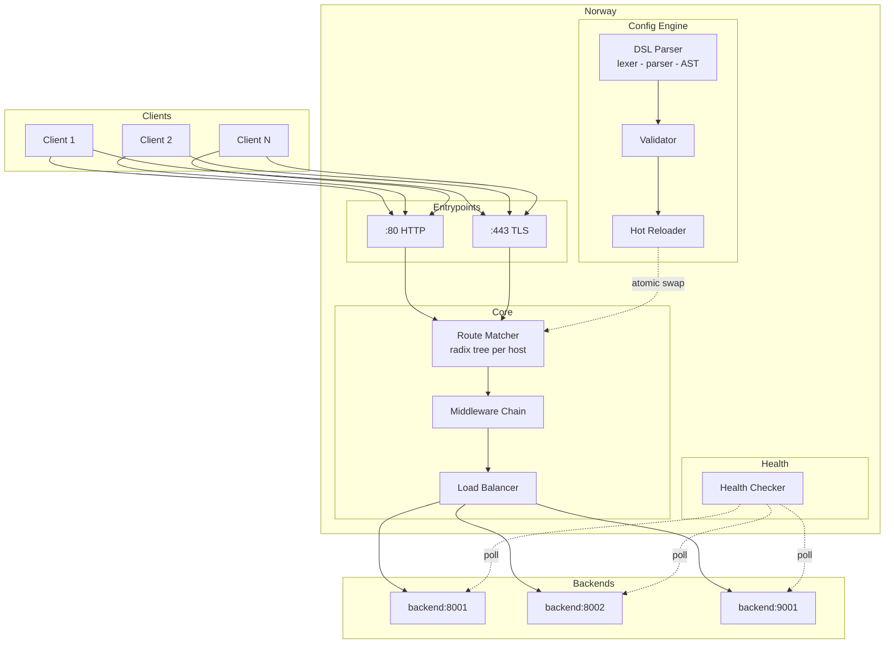
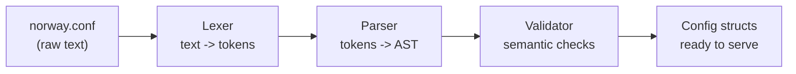
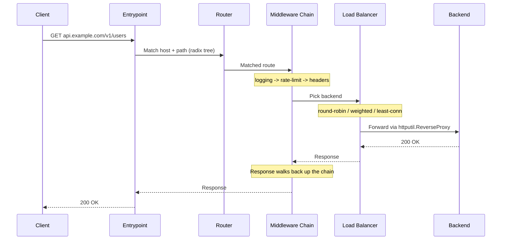

# norway

A focused, observable reverse proxy with a clean config DSL. An alternative to Traefik for people who don't need Kubernetes, service discovery, or a 100MB binary.

Norway is a single binary that reads a `.conf` file and proxies HTTP traffic to your backends with route matching, middleware chains, load balancing, and health checks. No YAML indentation hell, no 47-page documentation to read before you can route a request.

## Architecture



## The Config DSL

Norway uses its own config language. No YAML, no TOML, no JSON. Just a clean block-based DSL that's purpose-built for proxy configuration.

The DSL goes through a full compilation pipeline: `text -> tokens -> AST -> config structs -> validation`. Errors report exact line and column numbers.

```nginx
# entrypoints define where norway listens
entrypoint web {
    listen :80
}

entrypoint websecure {
    listen :443
    tls {
        cert /etc/norway/cert.pem
        key  /etc/norway/key.pem
    }
}

# services define backend pools
service api {
    balance round-robin

    health {
        path     /health
        interval 10s
        timeout  2s
    }

    server http://localhost:8001 {
        weight 3
    }
    server http://localhost:8002
}

# middlewares are reusable across routes
middleware rate-limit {
    type ratelimit
    rate 100
    burst 50
}

middleware logger {
    type logging
    format json
}

# routes are the glue: match requests and send them to services
route api {
    entrypoints web websecure
    host api.example.com
    path /v1/*
    service api
    use rate-limit
    use logger
}
```

Four block types, three layers of abstraction:
- **Entrypoints** define where to listen
- **Services** define where to forward (backends + load balancing + health checks)
- **Routes** match requests (host + path) and connect entrypoints to services
- **Middlewares** transform requests/responses, reusable across routes

### DSL Pipeline



The lexer tokenizes the raw text into typed tokens (idents, strings, numbers, braces, newlines). The parser consumes tokens and builds an AST of entrypoint/service/middleware/route nodes. The validator checks semantic correctness: do referenced services exist? Are there duplicate names? Is the balance strategy valid?

## Request Lifecycle



## Progress

### Implemented
- [x] Custom DSL with lexer, parser, and AST
- [x] Config validation with semantic checks
- [x] Skeleton reverse proxy with `httputil.ReverseProxy`

### Coming Up
- [ ] Radix tree routing
- [ ] Middleware chain
- [ ] Load balancing + health checks
- [ ] Rate limiting + stats endpoint
- [ ] Dynamic config reload
- [ ] TLS termination
- [ ] TUI dashboard
